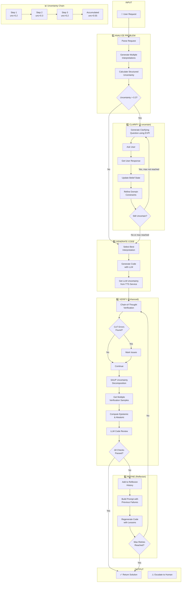
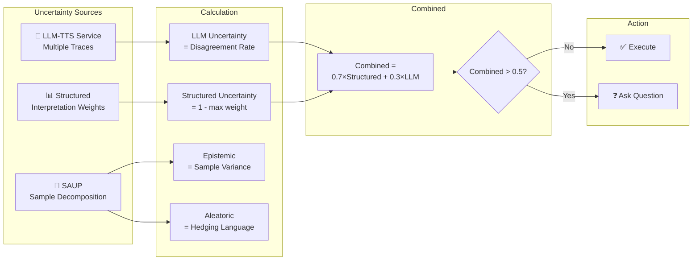
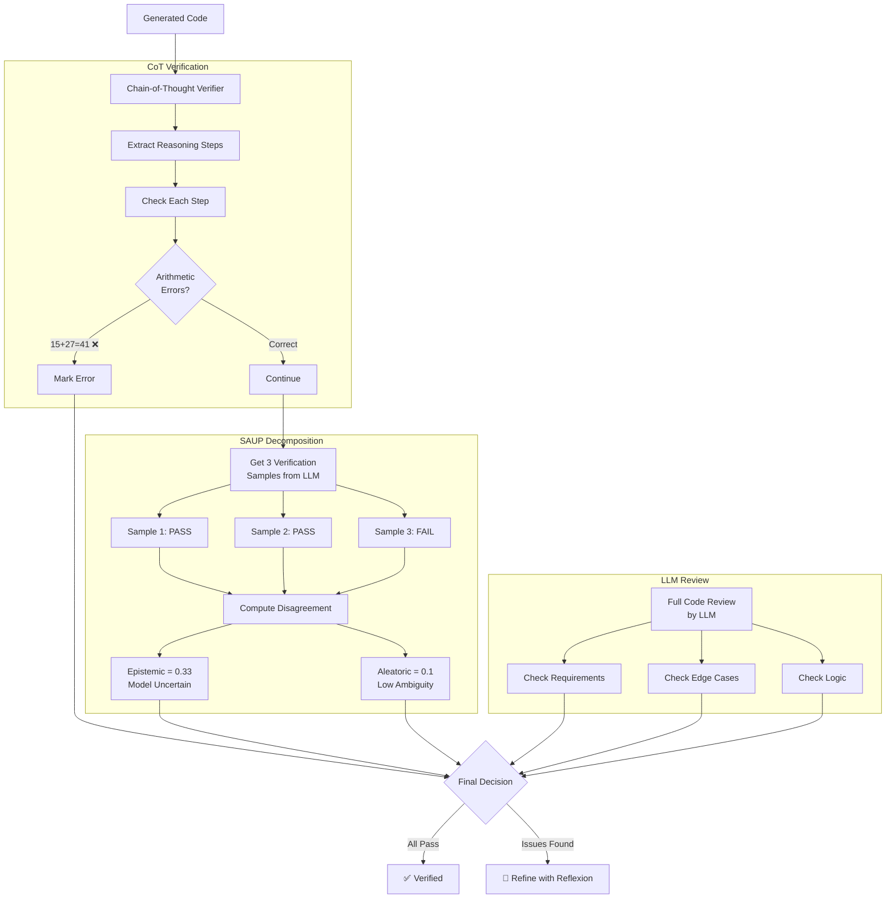
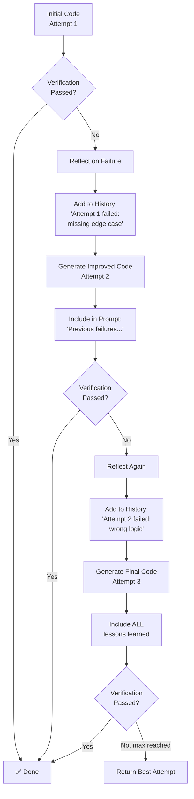
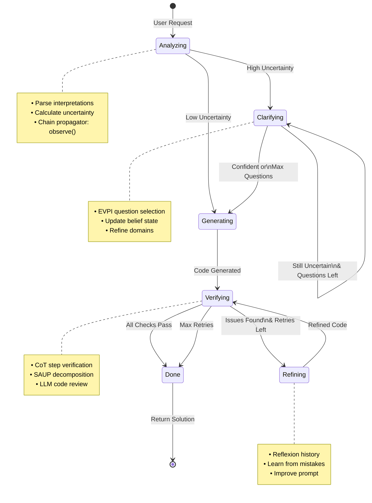
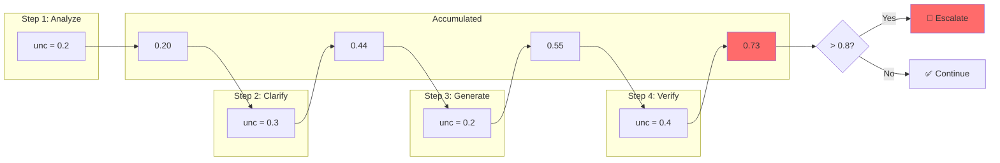
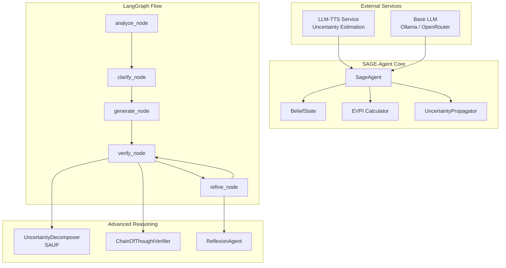

# SAGE-Agent Architecture Diagrams

## 1. Main Agent Flow (Complete)

## 2. Uncertainty Calculation Flow

## 3. Verification Pipeline (Enhanced)

## 4. Reflexion Self-Improvement Loop

## 5. Complete State Machine

## 6. Uncertainty Chain Propagation

## 7. Component Integration

---

## How to View These Diagrams

1. **GitHub**: GitHub renders Mermaid automatically
2. **VS Code**: Install "Markdown Preview Mermaid Support" extension
3. **Online**: Paste code at https://mermaid.live
4. **Export**: Use Mermaid CLI to export as PNG/SVG

