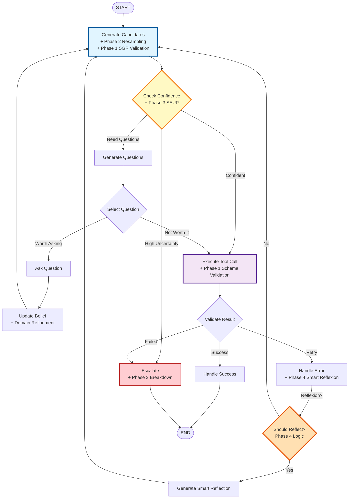
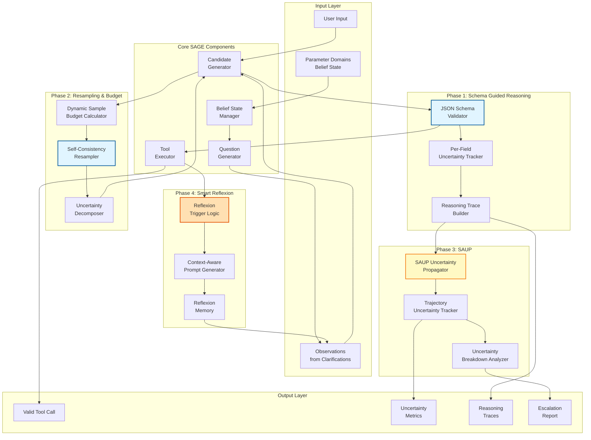
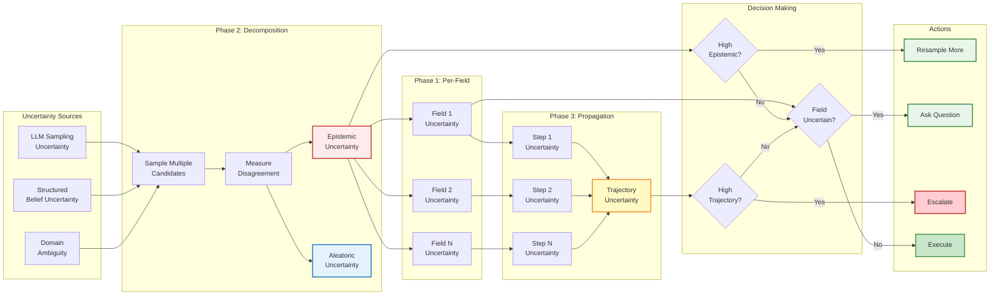
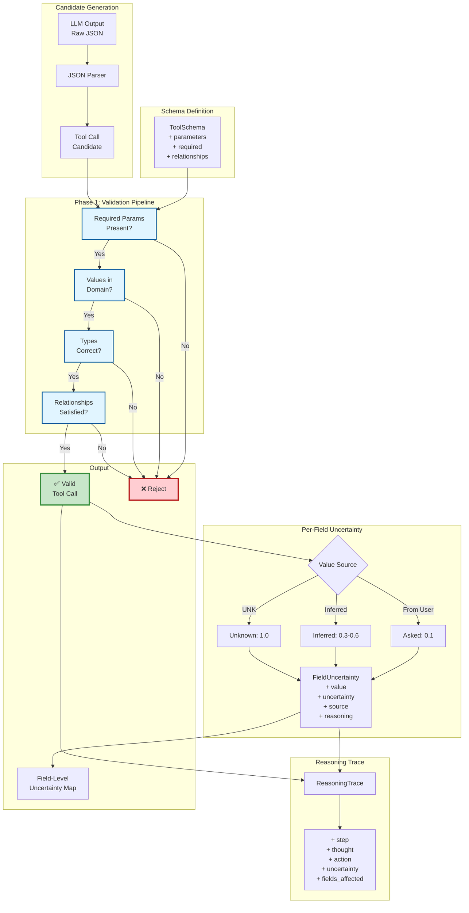
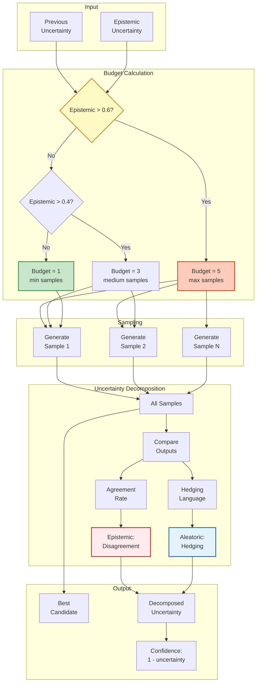
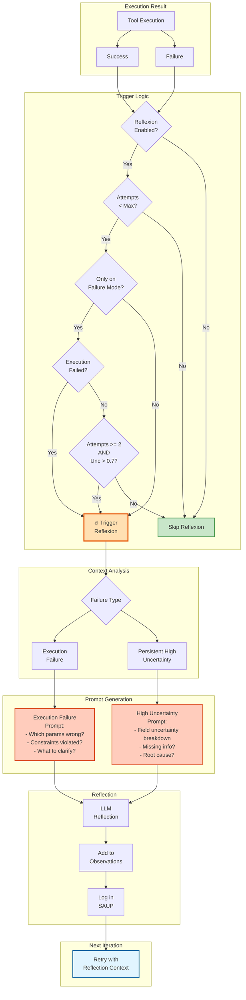
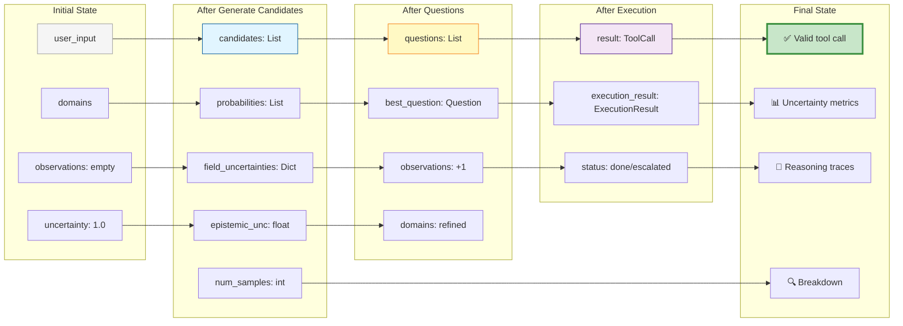
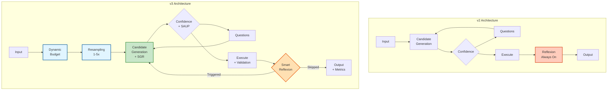
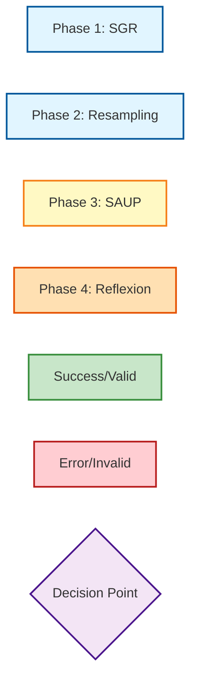

# SAGE Agent v3 Architecture Diagrams

## 1. Main Graph Flow (LangGraph State Machine)



## 2. Component Architecture



## 3. Uncertainty Flow Through Pipeline



## 4. Phase 1: Schema Guided Reasoning Detail



## 5. Phase 2: Resampling & Budget Allocation



## 6. Phase 3: SAUP Trajectory Tracking

```mermaid
graph TD
    subgraph "Step Tracking"
        S1[Step 1:<br/>Candidate Gen]
        S2[Step 2:<br/>Question Gen]
        S3[Step 3:<br/>Belief Update]
        S4[Step N:<br/>Execution]
    end

    subgraph "Per-Step Uncertainty"
        U1[u1 = 0.5]
        U2[u2 = 0.3]
        U3[u3 = 0.1]
        U4[u4 = 0.4]
    end

    subgraph "Propagation Mode"
        MODE{Mode}
        MULT[Multiplicative:<br/>1 - ∏(1-ui)]
        RW[Recency Weighted:<br/>Σ wi·ui / Σ wi]
        MAX[Max:<br/>max(ui)]
    end

    subgraph "Accumulated Uncertainty"
        ACCUM[Trajectory<br/>Uncertainty]
        HIGH[High Uncertainty<br/>Steps List]
    end

    subgraph "Escalation Logic"
        E1{Accum > 0.85?}
        E2{Too Many<br/>High Steps?}
        E3{Specific Step<br/>Very High?}
        ESC[Escalate]
        CONT[Continue]
    end

    subgraph "Breakdown"
        BD1[By Step Type]
        BD2[candidate_gen: 0.5]
        BD3[belief_update: 0.1]
        BD4[reflexion: 0.7]
        BD5[🔍 Root Cause:<br/>Reflexion step]
    end

    S1 --> U1
    S2 --> U2
    S3 --> U3
    S4 --> U4

    U1 --> MODE
    U2 --> MODE
    U3 --> MODE
    U4 --> MODE

    MODE --> MULT
    MODE --> RW
    MODE --> MAX

    MULT --> ACCUM
    RW --> ACCUM
    MAX --> ACCUM

    U1 --> HIGH
    U4 --> HIGH

    ACCUM --> E1
    HIGH --> E2
    U1 --> E3

    E1 -->|Yes| ESC
    E1 -->|No| E2
    E2 -->|Yes| ESC
    E2 -->|No| E3
    E3 -->|Yes| ESC
    E3 -->|No| CONT

    ESC --> BD1
    BD1 --> BD2
    BD1 --> BD3
    BD1 --> BD4
    BD4 --> BD5

    style ACCUM fill:#fff9c4,stroke:#f57f17,stroke-width:3px
    style HIGH fill:#ffccbc,stroke:#d84315,stroke-width:2px
    style ESC fill:#ffcdd2,stroke:#b71c1c,stroke-width:3px
    style BD5 fill:#ffe0b2,stroke:#e65100,stroke-width:2px
    style CONT fill:#c8e6c9,stroke:#388e3c,stroke-width:2px
```

## 7. Phase 4: Smart Reflexion



## 8. State Evolution Through Pipeline



## 9. Comparison: v2 vs v3 Architecture



## 10. Data Flow: Input → Output

```mermaid
flowchart LR
    INPUT["📝 User Query:<br/>'Book flight to LAX'"]

    subgraph P2["Phase 2: Budget & Resample"]
        BUDGET["Epistemic unc = 0.6<br/>→ Budget = 3 samples"]
        SAMPLE1["Sample 1:<br/>book_flight"]
        SAMPLE2["Sample 2:<br/>book_flight"]
        SAMPLE3["Sample 3:<br/>search_flights"]
        DISAGREE["Disagreement:<br/>Epistemic = 0.33"]
    end

    subgraph P1["Phase 1: SGR"]
        VALIDATE["Validate samples<br/>against schema"]
        VALID["✅ 2 valid<br/>❌ 1 invalid"]
        FIELDS["Field uncertainties:<br/>origin: 0.1<br/>dest: 0.5<br/>date: 0.8"]
    end

    subgraph P3["Phase 3: SAUP"]
        TRAJ["Trajectory unc:<br/>0.45 (3 steps)"]
        DECISION{High date<br/>uncertainty}
    end

    subgraph CLARIFY["Clarification"]
        ASK["Ask: 'What date?'"]
        ANSWER["User: 'Jan 15'"]
        UPDATE["Update domain:<br/>date: 0.8 → 0.1"]
    end

    subgraph FINAL["Execution"]
        EXEC["Execute:<br/>book_flight(<br/>  origin=NYC,<br/>  dest=LAX,<br/>  date=2024-01-15<br/>)"]
        SUCCESS["✅ Success"]
    end

    OUTPUT["📊 Output:<br/>status=done<br/>samples=3<br/>epistemic=0.33<br/>trajectory=0.45<br/>questions=1"]

    INPUT --> BUDGET
    BUDGET --> SAMPLE1 & SAMPLE2 & SAMPLE3
    SAMPLE1 & SAMPLE2 & SAMPLE3 --> DISAGREE
    DISAGREE --> VALIDATE
    VALIDATE --> VALID
    VALID --> FIELDS
    FIELDS --> TRAJ
    TRAJ --> DECISION
    DECISION -->|Yes| ASK
    ASK --> ANSWER
    ANSWER --> UPDATE
    UPDATE --> EXEC
    EXEC --> SUCCESS
    SUCCESS --> OUTPUT

    style INPUT fill:#e3f2fd,stroke:#1565c0,stroke-width:2px
    style DISAGREE fill:#ffebee,stroke:#c62828,stroke-width:2px
    style FIELDS fill:#fff9c4,stroke:#f57f17,stroke-width:2px
    style SUCCESS fill:#c8e6c9,stroke:#388e3c,stroke-width:3px
    style OUTPUT fill:#e1f5ff,stroke:#01579b,stroke-width:3px
```



---

## Legend



---

## Quick Reference

| Component | Purpose | Key Innovation |
|-----------|---------|----------------|
| **SGR Validation** | Ensure valid tool calls | 100% correctness guarantee |
| **Per-Field Uncertainty** | Track parameter-level uncertainty | Targeted clarification |
| **Dynamic Budget** | Adaptive sampling | 40% cost reduction on easy queries |
| **Epistemic/Aleatoric** | Decompose uncertainty | Know what's reducible |
| **SAUP Propagation** | Track trajectory uncertainty | Predict failures early |
| **Smart Reflexion** | Trigger-based reflection | 75% reduction in overhead |
| **Uncertainty Breakdown** | Root cause analysis | Pinpoint problem steps |

---

**Note**: These diagrams represent the logical architecture. The actual implementation uses LangGraph's state machine with TypedDict states and functional nodes.
